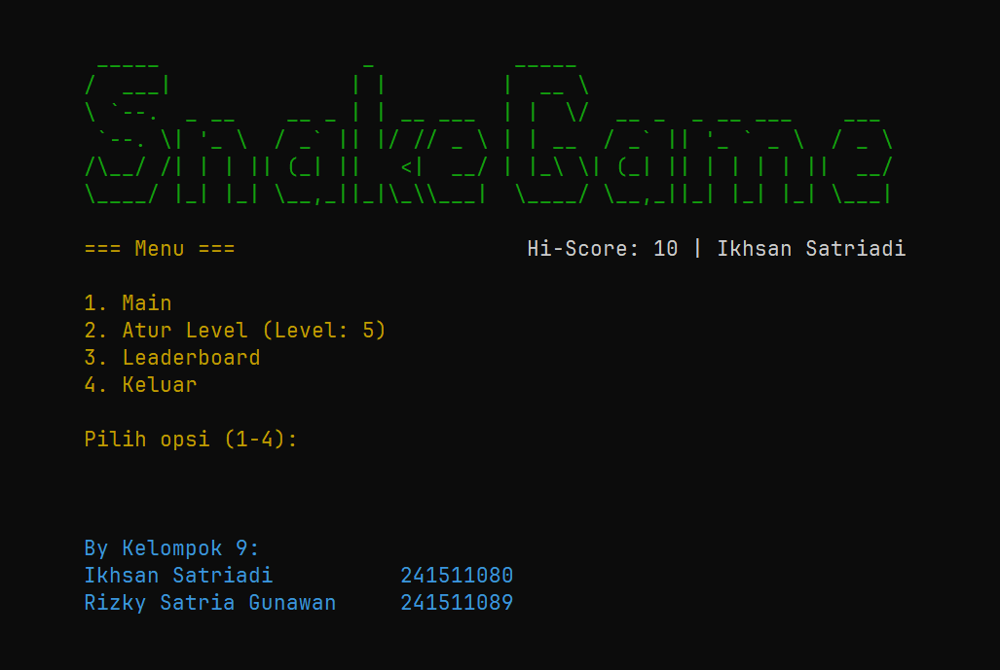
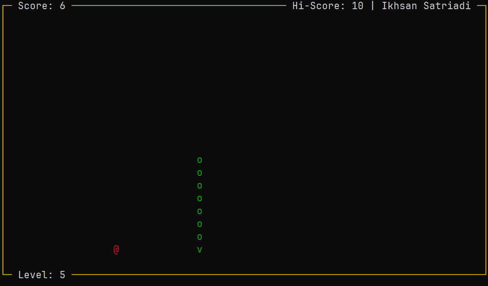
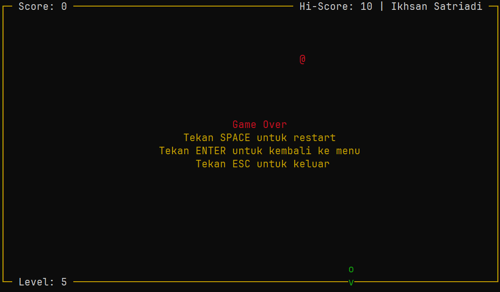

# Tugas Besar Praktikum Dasar-Dasar Pemrograman


Program ini adalah implementasi permainan klasik Snake yang dikembangkan sebagai tugas besar untuk mata kuliah Dasar-Dasar Pemrograman. Permainan ini bertujuan untuk memberikan pengalaman interaktif kepada pengguna dengan kontrol menggunakan keyboard dan tampilan yang sederhana di console.

| | |
| --- | --- |
|  |  |
|  |  |
|  |  |
|  |  |

## Anggota Kelompok

- **Ikhsan Satriadi** | 241511080
- **Rizky Satria Gunawan** | 241511089

## Fitur-Fitur Permainan Snake

- ### Menu Utama

  Pemain dapat memilih opsi:
  - Main: Memulai permainan.
  - Atur Level: Mengatur tingkat kesulitan permainan.
  - Leaderboard: Menampilkan daftar pemain dengan skor tertinggi.
  - Exit/Keluar dari permainan.

- ### Pengaturan Level

  Permainan menyediakan 5 level kesulitan yang memengaruhi kecepatan pergerakan ular. Semakin tinggi level, semakin cepat permainan berlangsung, sehingga menambah tantangan bagi pemain.

- ### Hi-Score dan Leaderboard

  - Setelah permainan berakhir, jika pemain mencapai skor tertinggi baru atau masuk ke dalam jajaran sepuluh besar skor tertinggi, mereka akan diminta memasukkan nama. Nama dan skor tersebut akan disimpan secara permanen.
  - Leaderboard menampilkan Top 10 skor tertinggi beserta nama pemain serta tanggal dalam urutan peringkat. Daftar ini diperbarui secara otomatis setiap kali pemain baru mencapai skor yang lebih tinggi dari skor yang ada.

- ### Fitur Pause

  Pemain dapat menjeda permainan kapan saja dengan menekan tombol ESC. Layar akan menampilkan pesan "Paused" hingga pemain melanjutkan permainan dengan menekan tombol spasi/space.

- ### Alur Permainan

  - Pemain mengontrol ular menggunakan tombol panah untuk bergerak ke empat arah.
  - Ular akan tumbuh jika memakan makanan yang muncul secara acak di layar.
  - Skor pemain bertambah seiring dengan jumlah makanan yang dikonsumsi.
  - Permainan akan berakhir jika ular menabrak dinding atau tubuhnya sendiri.
  - Setelah permainan berakhir, pemain dapat melihat skor yang diperoleh dan membandingkannya dengan Hi-Score yang tersimpan.
  
- ### Penyimpanan Data Permainan

  Program menyimpan data permainan dalam file biner, yang terdiri dari:
  - Data pengaturan/settings permainan, seperti level dan kecepatan permainan.
  - Leaderboard yang menyimpan Top 10 skor tertinggi beserta nama pemain untuk mencatat prestasi terbaik.

## Library yang Digunakan

### Standard Library

- **stdio.h**: Digunakan untuk operasi file, seperti `fopen`, `fclose`, `fread`, dan `fwrite`.
- **string.h**: Digunakan untuk manipulasi string, seperti `strcpy` dan `strcmp`.
- **stdlib.h**: Digunakan untuk fungsi-fungsi umum seperti `rand` dan `srand`.
- **stdbool.h**: Digunakan untuk mendukung tipe data boolean (`true` dan `false`).
- **time.h**: Digunakan untuk fungsi terkait waktu, seperti `time()` dan `srand()` untuk mengatur seed acak.
- **ctype.h**: Digunakan untuk fungsi yang memeriksa karakter, seperti `isprint`
- **unistd.h**: Digunakan untuk fungsi-fungsi POSIX, seperti `usleep()` yang digunakan untuk menunda eksekusi program.

### Library Tambahan

- **curses.h**: Digunakan untuk membuat antarmuka pengguna berbasis teks yang lebih interaktif dan responsif.

## Struktur Program

Program ini terdiri dari beberapa file sumber yang masing-masing memiliki tanggung jawab tertentu:

- **main.c**: Titik masuk program yang mengatur siklus permainan.
- **vector**: Mengelola operasi terkait dengan tipe data `Vector2`.
- **snake**: Mengelola logika pergerakan dan pertumbuhan ular.
- **food**: Mengelola logika pembuatan dan interaksi makanan.
- **score**: Mengelola logika penghitungan dan penyimpanan skor.
- **settings**: Mengelola pengaturan permainan, termasuk level dan kecepatan.
- **gamedata**: Mengelola penyimpanan dan pemuatan data permainan.
- **game**: Mengelola logika utama permainan dan interaksi antar objek
- **ui**: Mengelola antarmuka pengguna, termasuk tampilan menu dan elemen permainan.
- **datetime**: Mengelola fungsi terkait waktu dan tanggal.

## Menjalankan Program

### Kompilasi Program

- Install library `ncurses` untuk pengguna **Linux dan MacOS**. Pada **Windows**, library `pdcurses` sudah tersedia di dalam folder `lib` dan `include`.

- Cara install `ncurses`:
  - [Linux](https://www.cyberciti.biz/faq/linux-install-ncurses-library-headers-on-debian-ubuntu-centos-fedora/)
  - [MacOS](https://gist.github.com/cnruby/960344)

- Install GNU `make`.

- Buat direktori `build:

  ```sh
  mkdir build
  ```

- Buka terminal dan arahkan ke direktori projek. Lalu gunakan perintah berikut untuk mengkompilasi program:

  ```sh
  make
  ```

### Jalankan Program

Setelah program berhasil dikompilasi, gunakan perintah berikut untuk menjalankan program:

```sh
./build/snake
```
