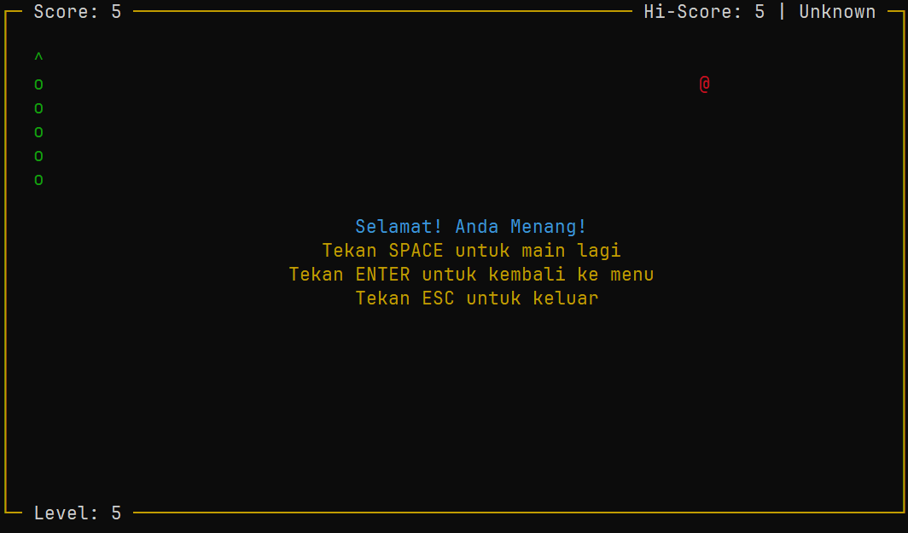

# Tugas Besar Praktikum Dasar-Dasar Pemrograman


Program ini adalah implementasi permainan klasik Snake yang dikembangkan sebagai tugas besar untuk mata kuliah Dasar-Dasar Pemrograman. Permainan ini bertujuan untuk memberikan pengalaman interaktif kepada pengguna dengan kontrol menggunakan keyboard dan tampilan yang sederhana di console.

| | |
| --- | --- |
|  |  |
|  |  |
|  |  |

## Anggota Kelompok

- **Ikhsan Satriadi** | 241511080
- **Rizky Satria Gunawan** | 241511089

## Fitur-Fitur Permainan Snake

- ### Menu Utama

  Menampilkan opsi untuk memulai permainan, mengatur level, atau keluar dari permainan.

- ### Pengaturan Level

  Memungkinkan pemain untuk memilih level permainan yang mempengaruhi kecepatan ular. Level tersedia dari 1 sampai 5.

- ### Hi-Score

  Menampilkan skor saat ini dan menyimpan skor tertinggi (hi-score) yang dicapai oleh pemain. Pemain diminta untuk memasukkan nama mereka setelah mencapai hi-score baru, yang akan disimpan bersama dengan skor tertinggi.

- ### Fitur Pause

  Memungkinkan pemain untuk menjeda permainan dengan menekan tombol ESC, dengan tampilan yang menunjukkan pesan "Paused".

- ### Tampilan Grafis yang Smooth

  Menggunakan library curses untuk menciptakan antarmuka teks interaktif dengan pengaturan warna, pembaruan layar yang efisien dan kontrol kursor memberikan pengalaman bermain yang lebih halus dan responsif serta merespons input pengguna secara real-time untuk memberikan kontrol yang lancar selama permainan.

- ### Penyimpanan dan Pemulihan Data

  Menyimpan data permainan, termasuk hi-score dan pengaturan, dalam file biner agar lebih aman.

## Library yang Digunakan

### Standard Library

- **stdio.h**: Digunakan untuk operasi file, seperti `fopen`, `fclose`, `fread`, dan `fwrite`.
- **string.h**: Digunakan untuk manipulasi string, seperti `strcpy` dan `strcmp`.
- **stdlib.h**: Digunakan untuk fungsi-fungsi umum seperti `rand` dan `srand`.
- **stdbool.h**: Digunakan untuk mendukung tipe data boolean (`true` dan `false`).
- **time.h**: Digunakan untuk fungsi terkait waktu, seperti `time()` dan `srand()` untuk mengatur seed acak.
- **unistd.h**: Digunakan untuk fungsi-fungsi POSIX, seperti `usleep()` yang digunakan untuk menunda eksekusi program.

### Library Tambahan

- **curses.h**: Digunakan untuk membuat antarmuka pengguna berbasis teks yang lebih interaktif dan responsif.

## Alur Permainan

1. Pemain disambut dengan menu utama untuk memulai permainan, mengatur level, atau keluar.

2. Pemain dapat memilih level yang mempengaruhi kecepatan ular.

3. Ular muncul di tengah layar, dan makanan dihasilkan secara acak.

4. Pemain mengendalikan ular menggunakan tombol panah untuk bergerak dan mengubah arah.

5. Ular tumbuh dan skor bertambah setiap kali makanan dikumpulkan. Makanan baru muncul secara acak.

6. Skor pemain ditampilkan, dan hi-score diperbarui jika pemain mencapai skor lebih tinggi.

7. Permainan berakhir jika ular menabrak dinding atau tubuhnya sendiri, dengan tampilan "Game Over".

8. Pemain dapat menjeda permainan dengan menekan tombol ESC.

9. Pemain dapat keluar dari permainan melalui menu utama atau saat permainan berlangsung.

10. Data permainan, termasuk hi-score, disimpan dan dapat dimuat kembali saat permainan dimulai.

## Struktur Program

Program ini terdiri dari beberapa file sumber yang masing-masing memiliki tanggung jawab tertentu:

- **main.c**: Titik masuk program yang mengatur siklus permainan.
- **vector.c**: Mengelola operasi terkait dengan tipe data `Vector2`.
- **snake.c**: Mengelola logika pergerakan dan pertumbuhan ular.
- **food.c**: Mengelola logika pembuatan dan interaksi makanan.
- **score.c**: Mengelola logika penghitungan dan penyimpanan skor.
- **settings.c**: Mengelola pengaturan permainan, termasuk level dan kecepatan.
- **gamedata.c**: Mengelola penyimpanan dan pemuatan data permainan.
- **game.c**: Mengelola logika utama permainan dan interaksi antar objek
- **ui.c**: Mengelola antarmuka pengguna, termasuk tampilan menu dan elemen permainan.

## Menjalankan Program

### Kompilasi Program

- Install library `ncurses` untuk pengguna **Linux dan MacOS**.

- Install GNU `make`.

- Buka terminal dan arahkan ke direktori projek. Lalu gunakan perintah berikut untuk mengkompilasi program:

  ```sh
  make
  ```

### Jalankan Program

Setelah program berhasil dikompilasi, gunakan perintah berikut untuk menjalankan program:

```sh
./build/snake
```
